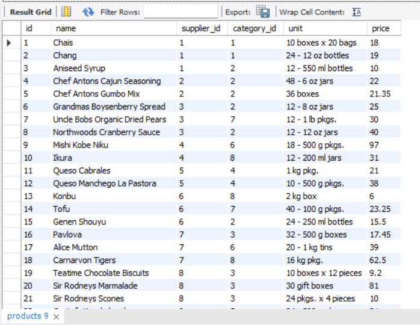
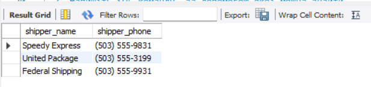
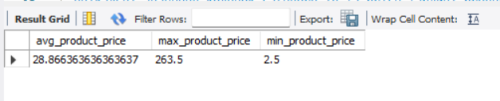
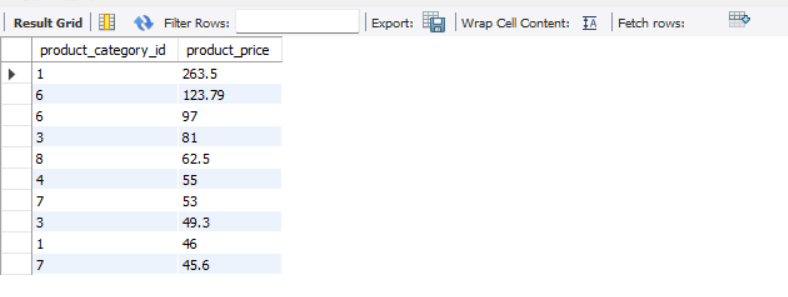
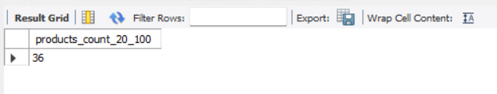
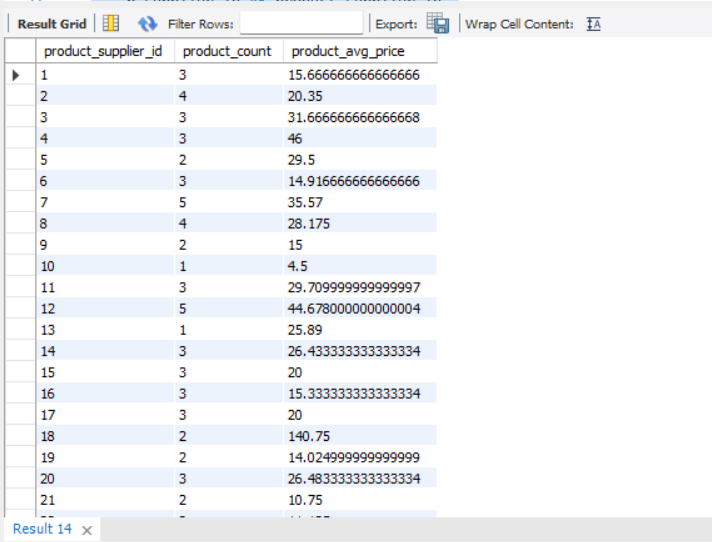

# goit-rdb-hw-03

## Homework overview

This repository contains SQL queries, execution results, and the ER diagram for homework assignment 03.

## Repository structure

* `queries.sql` — all SQL queries for the assignment
* `images/` — screenshots of executed queries and results
* `README.md` — short description of the work

## ER Diagram


---

## Task 1

Write SQL commands to:

* select all columns from the `products` table using wildcard `*`
* select only `name` and `phone` columns from the `shippers` table

### SQL code

```sql
-- Task 1.1
SELECT * FROM products;

-- Task 1.2
SELECT
    s.name AS shipper_name,
    s.phone AS shipper_phone
FROM
    shippers AS s;
```

### Screenshots

**Task 1.1 Result**



**Task 1.2 Result**



---

## Task 2

Find the average, maximum, and minimum value of the `price` column in the `products` table.

### SQL code

```sql
-- Task 2
SELECT
    AVG(p.price) AS avg_product_price,
    MAX(p.price) AS max_product_price,
    MIN(p.price) AS min_product_price
FROM
    products AS p;
```

### Screenshot



---

## Task 3

Select unique values of `category_id` and `price` from the `products` table, sort the result by `price` in descending order, and display only 10 rows.

### SQL code

```sql
-- Task 3
SELECT DISTINCT
    p.category_id AS product_category_id,
    p.price AS product_price
FROM
    products AS p
ORDER BY
    p.price DESC
LIMIT 10;
```

### Screenshot



---

## Task 4

Find the number of products with `price` between 20 and 100.

### SQL code

```sql
-- Task 4
SELECT
    COUNT(p.id) AS products_count_20_100
FROM
    products AS p
WHERE
    p.price BETWEEN 20 AND 100;
```

### Screenshot



---

## Task 5

Find the number of products and the average price for each supplier (`supplier_id`).

### SQL code

```sql
-- Task 5
SELECT
    p.supplier_id AS product_supplier_id,
    COUNT(p.id) AS product_count,
    AVG(p.price) AS product_avg_price
FROM
    products AS p
GROUP BY
    p.supplier_id;
```

### Screenshot



---

## Conclusion

All queries were executed and verified in MySQL Workbench.
