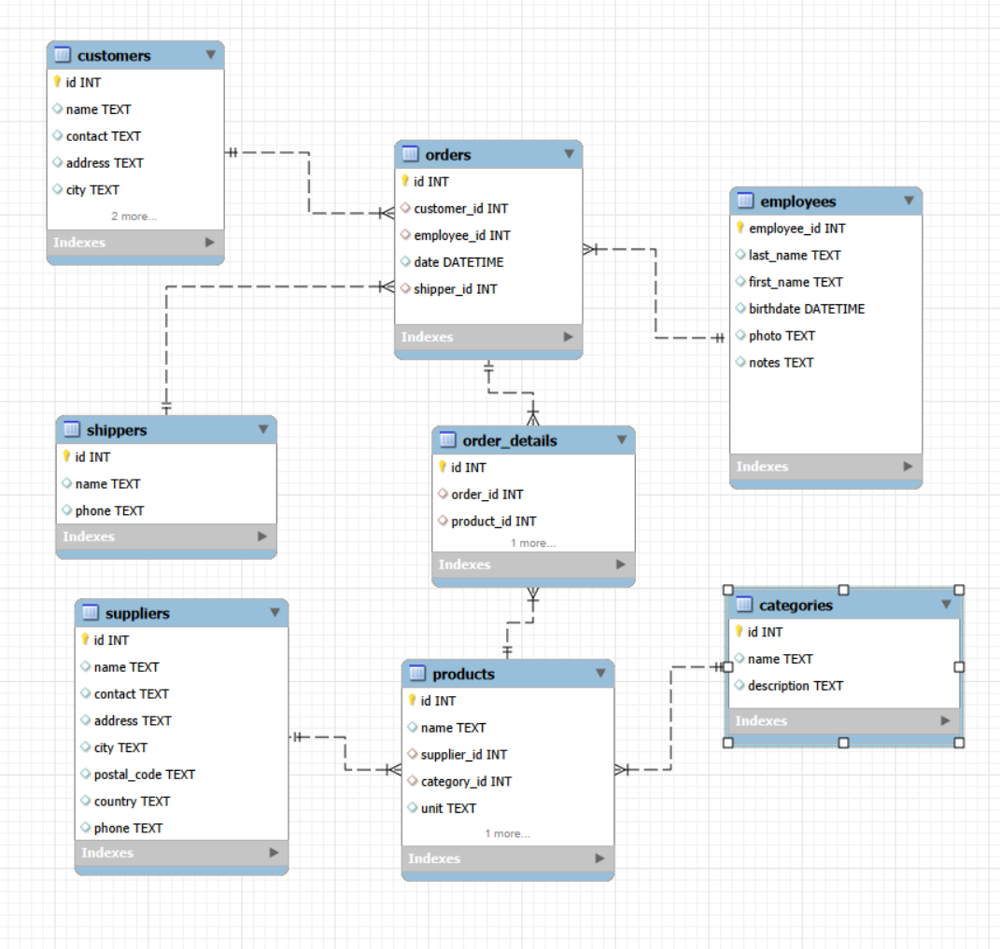

# goit-rdb-hw-03

## Task overview
This repository contains SQL queries and screenshots for homework assignment 03.

## Database structure
ER diagram of the imported database:

## Files
- `queries.sql` — all SQL queries for the assignment
- `images/` — screenshots of executed queries and results
